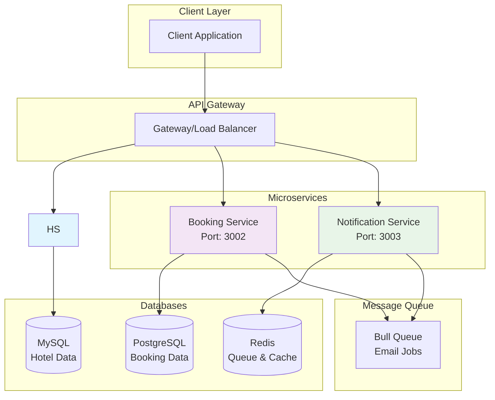
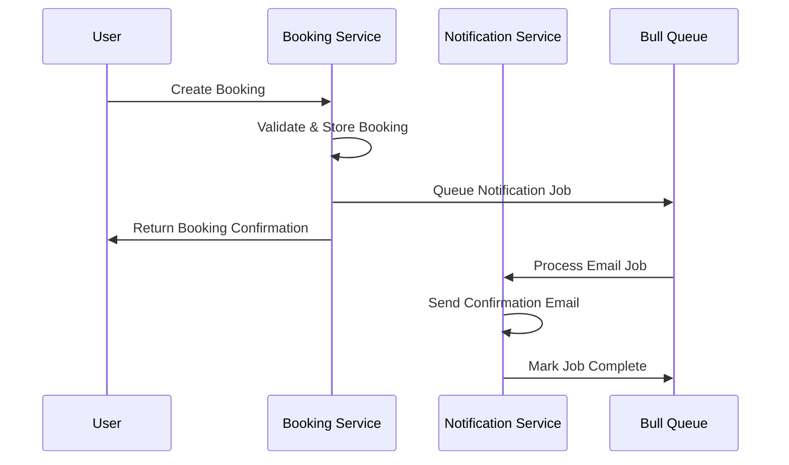

# 🏠 Airbnb Clone - Microservices

> A microservices-based Airbnb clone built with Node.js, TypeScript, and Docker for scalable hospitality platform management.

[](https://nodejs.org/)
[](https://www.typescriptlang.org/)
[](https://www.docker.com/)
[](https://pnpm.io/)

## 📋 Table of Contents

- [Overview](#-overview)
- [System Architecture](#-system-architecture)
- [Services](#-services)
- [Tech Stack](#-tech-stack)
- [Quick Start](#-quick-start)
- [Development](#-development)

## 🌟 Overview

A production-ready, microservices-based Airbnb clone featuring booking operations, and notification services. Built with modern technologies and containerized for scalable deployment.

## 🏛️ System Architecture



### Service Communication Flow



## 🚀 Services

### Booking Service (Port 3002)
- **Purpose**: Booking operations and reservation management
- **Database**: PostgreSQL with Prisma ORM
- **Features**:
  - Reservation creation and management
  - Booking status tracking
  - Cancellation handling

### Notification Service (Port 3003)
- **Purpose**: Email notifications and messaging
- **Database**: Redis for queue management
- **Features**:
  - Asynchronous email processing
  - Bull Queue for job management
  - Template-based notifications
  - Delivery status tracking

## 🛠️ Tech Stack

### Backend Core
```
🚀 Runtime          │ Node.js 18+ with Express.js
📘 Language         │ TypeScript for type safety
📦 Package Manager  │ npm for efficient dependency management
```

### Databases & Storage
```
🗄️ Booking Data     │ PostgreSQL with Prisma ORM
🔄 Queue & Cache    │ Redis with Bull Queue
```

## 🚀 Quick Start

### Prerequisites
- **Node.js** 18+ and **npm**
- **Git** for version control

### Service Endpoints

Once running, services will be available at:
- **Booking Service**: `http://localhost:3002`
- **Notification Service**: `http://localhost:3003`


**Built with ❤️ using modern microservices architecture**

> ⭐ Star this repo if you find it helpful!
